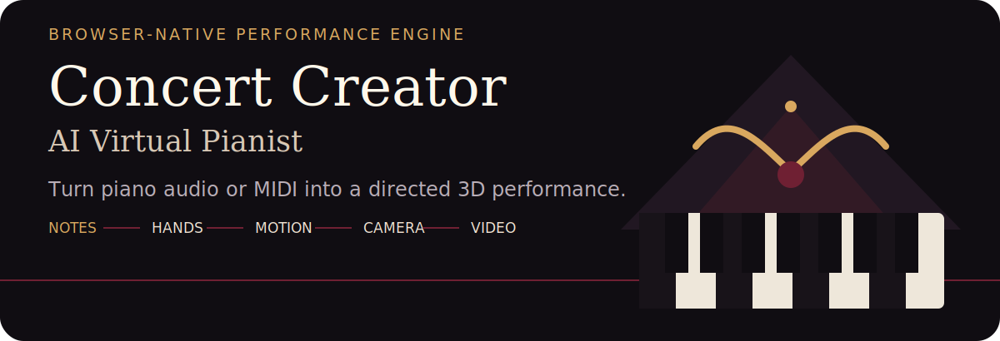

<p align="center">
  
</p>

Concert Creator is an unofficial, from-scratch recreation of the discontinued Concert Creator AI by Massive Technologies. Drop in a solo-piano recording or MIDI file; the browser transcribes the notes, assigns hands and fingers, choreographs a pianist, directs the cameras, and exports a video.

**The complete pipeline runs locally in the browser. Your recording is not uploaded.**

## Try it locally

```bash
npm install
npm run dev
```

Open the printed local URL, choose one of the built-in pieces, or drop a `.mid`, `.mp3`, `.wav`, `.ogg`, or `.flac` solo-piano file.

```bash
npm test
npm run typecheck
npm run build
```

## From recording to performance

```text
audio / MIDI
     ↓
transcription
     ↓
hand separation → fingering
     ↓
body + hand choreography
     ↓
phrase-aware camera plan
     ↓
Three.js stage → MP4 / WebM
```

1. **Transcribe.** Audio runs through Spotify Basic Pitch in TensorFlow.js. MIDI skips transcription, and two-track MIDI preserves its existing hand split.
2. **Separate hands.** A Viterbi pass evaluates contiguous pitch splits, movement, span, and crossings.
3. **Choose fingering.** A second Viterbi pass assigns fingers 1–5 with comfortable-span costs, including thumb-under motion.
4. **Choreograph.** Deterministic wrist springs, lookahead, press envelopes, inverse kinematics, body movement, gaze, and pedal position can be sampled at any time.
5. **Direct.** Phrase boundaries drive a seeded planner for wide shots, close-ups, top-down views, orbits, and first-person angles.
6. **Render.** An offline frame loop uses WebCodecs and MP4/WebM muxing. Audio projects retain the uploaded recording; MIDI projects use the built-in piano synth.

## Edit the result

The note strip keeps the generated performance inspectable. Select a note to:

- move it to the other hand;
- pin a finger from 1–5;
- mute it;
- re-solve the surrounding fingering and choreography.

The studio also exposes camera modes, lighting moods, hand colours, a falling-note roll, Top View, and First Person. The stage contains an animated 88-key piano, a sculptural pianist rig, spotlights, reflections, and post-processing.

## Architecture

```text
src/core    Testable music logic: MIDI, keyboard, hand split, fingering,
            choreography, cameras, synth, and demo pieces
src/scene   Three.js stage, pianist rig, IK, piano, keys, cameras, and post
src/state   Observable project store and processing pipeline
src/ui      Library, processing, studio, controls, and render modal
src/export  Timestamp generation, WebCodecs, and deterministic muxing
```

The Basic Pitch model and piano samples are served locally. Design notes and implementation plans live in [`docs/superpowers/`](docs/superpowers/), while the Blender reference workflow is documented in [`docs/BLENDER.md`](docs/BLENDER.md).

## Honest limits

- Dense or pedal-heavy audio can require corrections in the note editor; MIDI is the most reliable input.
- The pianist is intentionally sculptural. The realism budget goes to motion and timing rather than scanned-human rendering.
- Sheet-music display and AR/VR modes from the original product are outside this recreation’s scope.

Concert Creator is a technical homage and is not affiliated with Massive Technologies.
